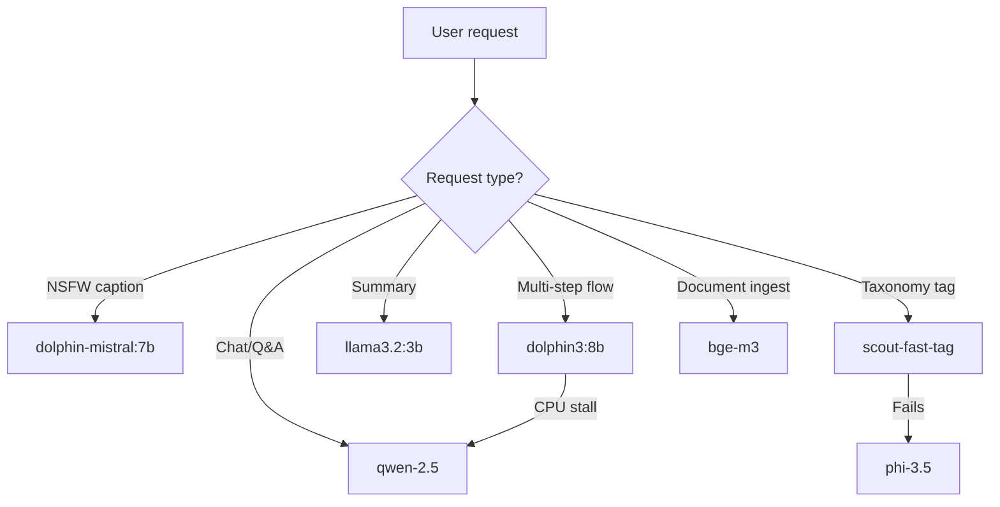

Genie Helper uses a multi-model stack running on Ollama (port 11434) to balance performance, cost, and task specialization. All models run locally on the VPS with no external API calls.

## Model Inventory

| Model | Size | Role | Typical Use Case |
|-------|------|------|------------------|
| `dolphin3:8b-llama3.1-q4_K_M` | 4.9GB | Orchestrator | Tool planning, ACTION tag emission, multi-step reasoning |
| `dolphin-mistral:7b` | 4.1GB | Uncensored writer | NSFW captions, adult content drafts, fan messages |
| `qwen-2.5:latest` | 4.8GB | Primary agent | AnythingLLM agent, code generation, JSON output |
| `phi-3.5:latest` | 2.2GB | Fallback classifier | Lightweight taxonomy tagging when scout-fast-tag fails |
| `llama3.2:3b` | 2.0GB | Summarizer | Quick summaries, metadata extraction, lightweight tasks |
| `scout-fast-tag:latest` | 1.2GB | Taxonomy classifier | Fast 6-concept taxonomy tagging (custom SmolLM fine-tune) |
| `bge-m3:latest` | 2.4GB | Embeddings | Document embeddings for RAG, semantic search |

**Total RAM pinned**: ~21GB (4-5GB active at any time)

---

## Model Roles

### Primary Agent: `qwen-2.5:latest`

**Used by**: AnythingLLM workspace (default)

**Strengths**:
- Best code generation in the 7B class
- Reliable JSON output for structured tasks
- Good instruction following
- Handles most general-purpose agent tasks

**Weaknesses**:
- Tool calling is unreliable (hence Action Runner bypass)
- First token latency: ~33s in agent mode on CPU-only VPS
- Will stall on CPU-only hardware if context > 8K tokens

**When to use**:
- Default for all AnythingLLM chat interactions
- Code generation (scripts, flows, API integrations)
- Structured data extraction
- Technical Q&A

---

### Orchestrator: `dolphin3:8b-llama3.1-q4_K_M`

**Used by**: Action Runner flow planning (optional)

**Strengths**:
- Excellent at multi-step planning
- Reliable ACTION tag emission
- Uncensored but still coherent for reasoning tasks
- Better tool selection than Qwen-2.5

**Weaknesses**:
- Slower inference (~45s first token on CPU)
- Larger memory footprint (4.9GB)
- Currently stalls on production VPS (CPU-only)

**When to use**:
- Complex workflows requiring multi-step reasoning
- When you need better tool selection than Qwen-2.5
- **Requires GPU VPS or wait for hardware upgrade**

---

### Content Writer: `dolphin-mistral:7b`

**Used by**: Caption generation, fan message drafting

**Strengths**:
- Fully uncensored (no refusals on NSFW content)
- Creative, natural-sounding prose
- Good at matching tone/style from examples
- Fast inference (~2-5s first token)

**Weaknesses**:
- Less structured than Qwen (worse for JSON)
- Can be overly verbose
- Not suitable for technical tasks

**When to use**:
- Drafting OnlyFans/Fansly captions
- Fan engagement messages (DMs, comments)
- Content descriptions and marketing copy
- Any NSFW text generation

**API endpoint**: `POST /api/captions/generate` (uses this model)

---

### Taxonomy Classifier: `scout-fast-tag:latest`

**Used by**: `taxonomy-tag` ACTION flow

**Strengths**:
- Custom fine-tune on 3,208 taxonomy tags
- Fast inference (~500ms per image)
- Optimized for 6-concept classification
- Low memory footprint (1.2GB)

**Weaknesses**:
- Single-purpose model (only taxonomy)
- Requires fallback to `phi-3.5` on failure
- Limited to visual content classification

**When to use**:
- Auto-tagging uploaded media
- Batch classification of scraped content
- Content audit (NSFW detection, theme analysis)

**Output format**:
```json
{
  "concepts": {
    "aesthetic": ["glamour", "luxury"],
    "activity": ["posing"],
    "mood": ["confident"],
    "setting": ["indoor", "bedroom"],
    "attire": ["lingerie"],
    "bodyType": ["athletic"]
  }
}
```

---

### Fallback Classifier: `phi-3.5:latest`

**Used by**: Taxonomy tagging when `scout-fast-tag` fails

**Strengths**:
- General-purpose vision model
- More robust on edge cases
- Can handle text + image input

**Weaknesses**:
- Slower than scout-fast-tag (~3-5s)
- Less accurate on Genie Helper's specific taxonomy
- May refuse NSFW content (has guardrails)

**When to use**:
- Backup for failed scout-fast-tag calls
- Mixed content (text + image analysis)
- When you need explanations for classifications

---

### Summarizer: `llama3.2:3b`

**Used by**: Quick summaries, metadata extraction

**Strengths**:
- Fastest inference (~1-2s first token)
- Lowest memory footprint (2GB)
- Good at extracting key points

**Weaknesses**:
- Limited context window (4K tokens)
- Less coherent on complex topics
- Not suitable for multi-turn chat

**When to use**:
- Summarizing scraped profile data
- Extracting metadata from long text
- Quick content previews
- Notifications and alerts

---

### Embeddings: `bge-m3:latest`

**Used by**: AnythingLLM document embeddings, RAG

**Strengths**:
- State-of-the-art multilingual embeddings
- Fast batch processing
- Supports 8K token context

**When to use**:
- Ingesting documents into AnythingLLM workspaces
- Semantic search over creator content
- Memory recall ("What did I post last week?")

**Not used for**: Text generation (embeddings-only model)

---

## Hardware Constraints

**Current server**: IONOS dedicated VPS, CPU-only (no GPU)

**Performance characteristics**:
- Models up to 7B: Acceptable performance (2-5s first token)
- Models 8B+: Stall on CPU-only (dolphin3:8b takes 45s+)
- Recommended limit: 7B quantized models (q4_K_M)

**Future upgrade path**:
- GPU VPS: Enables dolphin3:8b and larger models
- Alternative: Stick with Qwen-2.5 and optimize Action Runner flows

**Resource limits**:
- ~10GB RAM available for Ollama (after OS + other services)
- ~33 concurrent Stagehand browser sessions (300MB each)
- FFmpeg clip generation is the real bottleneck (~30s CPU per clip)

---

## Model Selection Logic



---

## Configuration

### Environment Variables

```bash
OLLAMA_URL=http://127.0.0.1:11434
OLLAMA_MODEL=qwen-2.5:latest  # Default for MCP server
STAGEHAND_MODEL=ollama/qwen-2.5  # For Stagehand vision tasks
```

### AnythingLLM Workspace Settings

**Administrator workspace**:
- LLM: `qwen-2.5:latest`
- Embeddings: `bge-m3:latest`
- Agent mode: Enabled
- Temperature: 0.7
- Max tokens: 4096

**Per-user workspaces** (future):
- Same settings, isolated context
- Potential routing to dolphin3:8b after GPU upgrade

---

## Related

- [MCP Servers](/ai/mcp-servers) — The `ollama` MCP server exposes these models
- [Action Runner](/ai/action-runner) — Uses models via `ollama` step type
- [Taxonomy System](/ai/taxonomy-system) — Uses scout-fast-tag for classification
- **Endpoint**: `POST /api/captions/generate` — Uses dolphin-mistral:7b