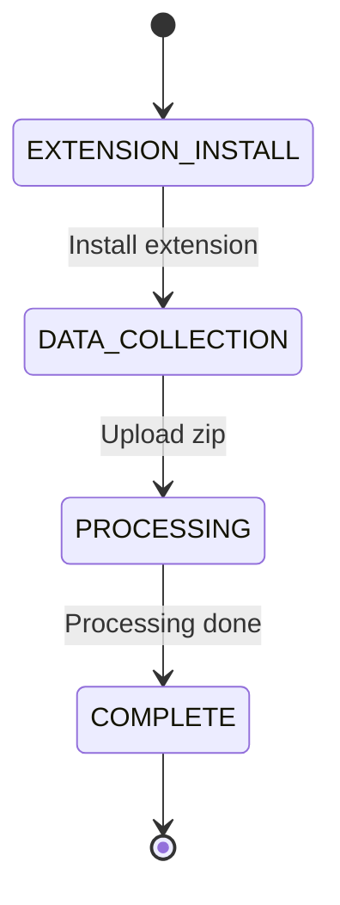

## Overview

The onboarding system guides new users through setup with a state machine tracking progress from extension installation through data collection and processing.

## GET /api/onboarding/state

Retrieve current onboarding state for authenticated user.

### Authentication

Requires Directus JWT token.

### Response

<ResponseField name="state" type="string">
  Current onboarding state: `EXTENSION_INSTALL`, `DATA_COLLECTION`, `PROCESSING`, or `COMPLETE`
</ResponseField>

<ResponseField name="userId" type="string">
  User ID from persona record
</ResponseField>

### Example

```bash cURL
curl http://localhost:3001/api/onboarding/state \
  -H "Authorization: Bearer YOUR_JWT_TOKEN"
```

<Accordion title="Example Response">
```json
{
  "state": "DATA_COLLECTION",
  "userId": "abc-123"
}
```
</Accordion>

## PATCH /api/onboarding/state

Update onboarding state for authenticated user.

### Request Body

<ParamField path="state" type="string" required>
  New state: `EXTENSION_INSTALL`, `DATA_COLLECTION`, `PROCESSING`, or `COMPLETE`
</ParamField>

### Response

Returns updated persona record with new onboarding state.

### Example

```bash cURL
curl -X PATCH http://localhost:3001/api/onboarding/state \
  -H "Authorization: Bearer YOUR_JWT_TOKEN" \
  -H "Content-Type: application/json" \
  -d '{"state": "COMPLETE"}'
```

## POST /api/onboarding/zip-upload

Upload data export zip file for processing.

### Authentication

Requires Directus JWT token.

### Request Body

Multipart form data with single file field:

<ParamField path="file" type="file" required>
  ZIP file containing platform data export
</ParamField>

### Response

<ResponseField name="ok" type="boolean">
  Whether upload was successful
</ResponseField>

<ResponseField name="jobId" type="string">
  BullMQ job ID for tracking processing
</ResponseField>

<ResponseField name="filePath" type="string">
  Server path where zip was stored
</ResponseField>

### Example

```bash cURL
curl -X POST http://localhost:3001/api/onboarding/zip-upload \
  -H "Authorization: Bearer YOUR_JWT_TOKEN" \
  -F "file=@/path/to/export.zip"
```

<Accordion title="Example Response">
```json
{
  "ok": true,
  "jobId": "onboard-job-123456",
  "filePath": "/tmp/agentx-media/onboard-abc123.zip"
}
```
</Accordion>

## Onboarding State Machine



### State Descriptions

| State | Description | User Action |
|-------|-------------|-------------|
| `EXTENSION_INSTALL` | Initial state | Install browser extension |
| `DATA_COLLECTION` | Extension ready | Export and upload data |
| `PROCESSING` | Data being processed | Wait for completion |
| `COMPLETE` | Onboarding finished | Access full platform |

## Content Gate Integration

The Genie AI chat enforces onboarding completion:

- Users in `EXTENSION_INSTALL` or `DATA_COLLECTION` receive setup guidance
- Full AI features unlock only in `COMPLETE` state
- State checked on every chat request via `server/endpoints/api/genieChat.js`

## Related Endpoints

<CardGroup cols={2}>
  <Card title="Genie Chat" icon="robot" href="/api/genie-chat">
    AI chat with onboarding gate enforcement
  </Card>
  <Card title="User Profile" icon="user" href="/api/user">
    Update user persona and profile data
  </Card>
</CardGroup>

## Implementation

Source: `server/endpoints/api/onboarding.js`

Onboarding state stored in `user_personas.onboarding_state` (Directus collection).
