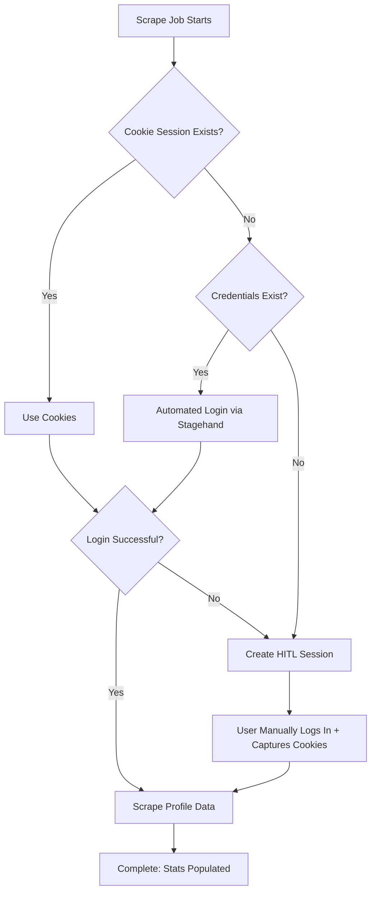

This guide walks you through connecting your first creator platform (OnlyFans, Fansly, etc.) and running an automated scrape to populate your dashboard with stats and content.

## Prerequisites

Before starting, make sure you have:

- A registered GenieHelper account
- Login credentials for your creator platform (OnlyFans, Fansly, etc.)
- Your platform @handle (the username in your profile URL)

<Warning>
  All credentials are AES-256-GCM encrypted at rest. GenieHelper uses them only for automated login and scraping. Never share your credentials via email or chat.
</Warning>

---

## Connecting Your Platform

<Steps>
  <Step title="Navigate to Platform Connections">
    From your dashboard sidebar, click **Platforms** or visit `/app/platforms` directly.

    You'll see a grid view of 18 supported platforms including OnlyFans, Fansly, ManyVids, Instagram, TikTok, X (Twitter), and more.
  </Step>

  <Step title="Click 'Add Platform'">
    Click the blue **Add Platform** button in the top-right corner.

    A modal will open with a 2-step wizard:
    1. Select platforms
    2. Enter credentials
  </Step>

  <Step title="Select Your Platform(s)">
    In the platform grid, click on one or more platforms you want to connect. Selected platforms show a checkmark badge.

    **Tip:** You can connect multiple platforms at once if you manage accounts across several sites.

    Click **Next** when ready.
  </Step>

  <Step title="Choose Authentication Method">
    For each platform, you'll see 2-3 authentication options:

    **Email / Password** (default):
    - Enter your profile @handle (e.g., `@yourhandle` for `onlyfans.com/yourhandle`)
    - Enter your login email or username
    - Enter your platform password

    **X / Twitter OAuth** (OnlyFans & Fansly only):
    - Used if you log in via "Sign in with X"
    - Enter your X/Twitter username
    - Enter your X/Twitter password
    - ⚠️ **2FA must be disabled on X first** — Stagehand browser automation doesn't support 2FA

    **Cookie Only**:
    - No password stored — you'll manually capture session cookies later via the browser extension
    - Enter your profile @handle only
  </Step>

  <Step title="Submit & Connect">
    Review your credentials and click **Connect Platform** (or **Connect 2 Platforms** if you selected multiple).

    The system will:
    - Encrypt your credentials with AES-256-GCM
    - Store them in the `creator_profiles` collection in Directus
    - Redirect you to the dashboard
  </Step>
</Steps>

---

## Understanding Authentication Flows

Genie Helper uses a **cookie-first auth cascade** to log in:

**Priority Order:**
1. **Cookies** (from browser extension) — fastest, most reliable
2. **Stored credentials** — automated Stagehand browser login
3. **HITL (Human-in-the-Loop)** — manual login with cookie capture

---

## Running Your First Scrape

<Steps>
  <Step title="Automatic Scrape Trigger">
    After connecting your platform, you'll be redirected to `/app/dashboard`.

    You'll see a blue banner:

    > **Setting up your dashboard…**  
    > Genie is preparing to scrape your OnlyFans profile. This will populate your media library and stats automatically.

    The scrape starts automatically in the background. No action needed.
  </Step>

  <Step title="Monitor Scrape Progress">
    The banner updates in real-time:

    **Scraping in progress:**
    - Green banner with spinning icon
    - "Scraping your profile data… Logging in and pulling your stats from OnlyFans. Usually takes 1–3 minutes."
    - Progress bar shows approximate completion

    **Behind the scenes:**
    - A `media_jobs` record is created with `operation: 'scrape_profile'` and `status: 'queued'`
    - BullMQ enqueues the job to the `media-worker` (Redis queue)
    - Stagehand browser automation logs into your platform using the auth cascade (cookies → credentials → HITL)
    - Profile stats (followers, posts, subscription price) are extracted
    - Media items are scraped and stored in `scraped_media` collection
  </Step>

  <Step title="Handle HITL If Needed">
    If Genie can't log in automatically (no cookies + credentials failed), you'll see a **yellow banner**:

    > **Manual login required**  
    > Genie needs your active session cookies. Log into OnlyFans in another tab, then capture cookies with the browser extension and hit Retry.

    **What to do:**
    1. Click **Cookie Sessions** button to open `/app/platforms?tab=sessions`
    2. Follow the [HITL Sessions guide](/guides/hitl-sessions) to capture cookies
    3. Return to the dashboard and click **Retry**

    The scrape will resume using your captured cookies.
  </Step>

  <Step title="Scrape Complete">
    When the scrape finishes:

    - Banner disappears (or shows a dismiss button)
    - Dashboard stat cards populate with live data:
      - **Followers** (e.g., 1,234)
      - **Posts** (e.g., 89)
      - **Scheduled** posts in queue
    - Platform connection status changes to **Connected** (green checkmark)
    - `last_scraped_at` timestamp updates

    Navigate to `/app/media` to see your scraped content library.
  </Step>
</Steps>

---

## Troubleshooting Common Issues

<AccordionGroup>
  <Accordion title="Scrape failed: Invalid credentials">
    **Cause:** Credentials are incorrect or platform changed their login flow.

    **Fix:**
    1. Go to `/app/platforms`
    2. Click the trash icon to remove the connection
    3. Re-add the platform with updated credentials
    4. Or switch to **Cookie Only** auth and use the browser extension
  </Accordion>

  <Accordion title="Scrape failed: Captcha encountered">
    **Cause:** Platform showed a CAPTCHA challenge during automated login.

    **Fix:**
    1. Use **Cookie Only** authentication instead
    2. Log in manually to the platform in your browser
    3. Complete the CAPTCHA
    4. Use the browser extension to capture cookies
    5. Retry the scrape — it will use your valid session
  </Accordion>

  <Accordion title="Scraping in progress for 10+ minutes">
    **Cause:** Stagehand browser session may be stuck.

    **Fix:**
    1. Check `media_jobs` collection in Directus admin panel (`/admin`)
    2. Look for the job with `operation: 'scrape_profile'` and `status: 'processing'`
    3. Note the job ID
    4. Ask in the support channel — the worker may need to be restarted
    5. Alternatively: refresh the page and click **Retry** in the dashboard banner
  </Accordion>

  <Accordion title="No stats showing after scrape">
    **Cause:** Scrape completed but didn't extract platform-specific stats.

    **Fix:**
    1. Go to `/app/platforms`
    2. Click the **Play icon** next to your platform connection to manually re-trigger the scrape
    3. Check the Network tab in DevTools for any API errors
    4. Verify your platform profile is public or accessible while logged in
  </Accordion>
</AccordionGroup>

---

## Expected Results

After a successful scrape, you should see:

<CardGroup cols={2}>
  <Card title="Dashboard Stats" icon="chart-line">
    - Total followers
    - Total posts
    - Subscription price
    - Last scraped timestamp
  </Card>
  
  <Card title="Media Library" icon="images">
    - Images, videos, and audio files
    - Engagement stats (likes, comments)
    - Media type badges
    - Thumbnails for videos
  </Card>
  
  <Card title="Platform Status" icon="plug">
    - Status: **Connected** (green)
    - Last scraped: timestamp
    - Scrape status: **complete**
  </Card>
  
  <Card title="Cookie Sessions" icon="cookie">
    - Active session captured
    - Platform name
    - Expiry date
    - Revoke button
  </Card>
</CardGroup>

---

## Next Steps

<CardGroup cols={2}>
  <Card title="Process Media" icon="wand-magic-sparkles" href="/guides/media-workflows">
    Apply watermarks, create teasers, compress files
  </Card>
  
  <Card title="Schedule Posts" icon="calendar-check" href="/guides/scheduling-posts">
    Queue content for automated publishing
  </Card>
  
  <Card title="HITL Sessions" icon="hand" href="/guides/hitl-sessions">
    Learn how to capture cookies with the browser extension
  </Card>
  
  <Card title="AI Captions" icon="sparkles" href="/api/captions">
    Generate engaging captions with uncensored AI
  </Card>
</CardGroup>

<Tip>
  **Pro tip:** Set up multiple platform connections and let Genie scrape them all in parallel. The media worker handles up to ~33 concurrent browser sessions.
</Tip>