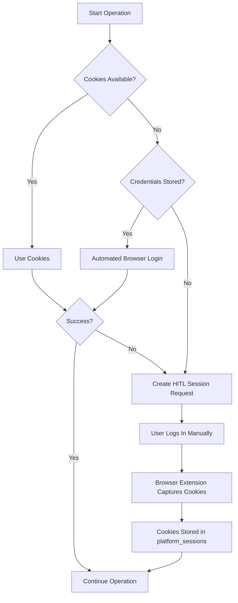

HITL (Human-in-the-Loop) sessions allow you to manually log into platforms and capture session cookies when automated login fails or isn't available. This is the **most reliable** authentication method for scraping and publishing.

## Why HITL?

### The Cookie-First Auth Cascade

Genie Helper uses a **3-tier authentication priority**:

**Why cookies are best:**
- ✅ **No CAPTCHA risk** — you've already solved it during manual login
- ✅ **2FA support** — you handle 2FA in your own browser
- ✅ **Platform updates** — works even if platform changes login flow
- ✅ **Fastest** — no browser automation overhead
- ✅ **Most reliable** — 99% success rate vs. ~70% for automated login

---

## Installing the Browser Extension

The GenieHelper Cookie Capture extension is available for Chrome, Firefox, and mobile browsers.

<Steps>
  <Step title="Download the Extension">
    Go to `/app/platforms` and click the **Cookie Sessions** tab.

    You'll see download links for:

    **Desktop:**
    - **Chrome / Brave / Edge** — `geniehelper-chrome.zip` (recommended for Chromium browsers)
    - **Firefox** — `geniehelper-firefox.zip`

    **Mobile:**
    - **Firefox for Android** — Install from [Firefox Add-ons](https://addons.mozilla.org/en-US/android/addon/geniehelper-cookie-capture/) or sideload the `.xpi`
    - **Kiwi Browser (Android)** — Install from Chrome Web Store or sideload the `.zip`
    - **Orion Browser (iOS)** — Supports Chrome & Firefox extensions natively

    Click the appropriate download button for your browser.
  </Step>

  <Step title="Load Extension Unpacked">
    **Chrome / Brave / Edge:**
    1. Go to `chrome://extensions`
    2. Enable **Developer mode** (toggle in top-right)
    3. Click **Load unpacked**
    4. Select the extracted `geniehelper-chrome` folder
    5. Extension appears with a cookie icon

    **Firefox:**
    1. Go to `about:debugging`
    2. Click **This Firefox** (left sidebar)
    3. Click **Load Temporary Add-on**
    4. Select the `manifest.json` file inside `geniehelper-firefox` folder
    5. Extension loads (will be removed on browser restart — use `.xpi` for permanent install)

    **Mobile (Firefox Android):**
    1. Open Firefox
    2. Go to Settings → Add-ons → Install add-on from file
    3. Select the downloaded `.xpi` file
    4. Grant permissions

    **Mobile (Kiwi Browser):**
    1. Open Kiwi Browser
    2. Go to Menu → Extensions → **(from .zip)**
    3. Select the `geniehelper-chrome.zip` file
    4. Grant permissions
  </Step>

  <Step title="Configure Extension Settings">
    In the **Cookie Sessions** tab on `/app/platforms`, you'll see 3 config values:

    **1. Server URL**  
    `https://geniehelper.com` (or your custom domain)

    **2. Directus Access Token**  
    Your JWT token (truncated for security: `abc123...xyz789`)

    **3. Creator Profile ID**  
    Your `creator_profiles` UUID from Directus

    **Copy each value:**
    1. Click the **Copy** button next to each field
    2. Right-click the extension icon → **Options** (or **Settings**)
    3. Paste the 3 values into the extension settings form
    4. Click **Save Settings**

    <Tip>
      Make sure to save these settings before attempting to capture cookies from any platform.
    </Tip>
  </Step>

  <Step title="Verify Extension is Ready">
    Click the extension icon in your browser toolbar.

    You should see:
    - Server URL displayed
    - Token status: **Configured** (green checkmark)
    - Profile ID: **Set** (green checkmark)
    - Platform detection: **Not on a supported platform** (gray, since you're on geniehelper.com)

    If any field shows **Not configured** (red X), go back to Step 3.
  </Step>
</Steps>

---

## Capturing Cookies: Step-by-Step

<Steps>
  <Step title="Trigger a HITL Request (or Proactive Capture)">
    There are 2 ways to capture cookies:

    **A. Reactive (HITL Banner):**
    1. Run a scrape or schedule a post
    2. If Genie can't log in automatically, you'll see a **yellow HITL banner** on the dashboard:

       > **Manual login required**  
       > Genie needs your active session cookies. Log into OnlyFans in another tab, then capture cookies with the browser extension and hit Retry.

    **B. Proactive (Before Operations):**
    1. Go to `/app/platforms` → **Cookie Sessions** tab
    2. Manually log into your platform in a new tab
    3. Capture cookies before running any operations (recommended)

    **Why proactive is better:**
    - Faster scrapes (no waiting for HITL cycle)
    - Prevents interruptions mid-operation
    - You can handle 2FA and CAPTCHAs calmly
  </Step>

  <Step title="Log Into Your Platform">
    Open a new browser tab and navigate to your platform:

    - OnlyFans: `https://onlyfans.com`
    - Fansly: `https://fansly.com`
    - Instagram: `https://instagram.com`
    - TikTok: `https://tiktok.com`
    - X (Twitter): `https://x.com`
    - etc.

    **Log in as you normally would:**
    - Enter username and password
    - Complete 2FA if prompted (SMS, authenticator app, email code)
    - Solve any CAPTCHAs
    - Verify you're on the logged-in homepage (profile pic visible)
  </Step>

  <Step title="Click the Extension Icon">
    With the platform page open and logged in, click the **GenieHelper cookie icon** in your browser toolbar.

    The popup will show:

    - **Detected Platform:** OnlyFans (or whichever you're on)
    - **Cookie Count:** 23 cookies detected
    - **Capture Button:** **Capture Cookies & Sync** (green, enabled)

    If the button is grayed out, you're either:
    - Not logged in (refresh and log in again)
    - On an unsupported platform
    - Extension not configured (go back to setup)
  </Step>

  <Step title="Click 'Capture Cookies & Sync'">
    Click the green **Capture Cookies & Sync** button.

    **What happens:**

    1. Extension reads all cookies for the current domain (e.g., `.onlyfans.com`)
    2. Includes HttpOnly cookies (critical for authentication)
    3. Sends them to your GenieHelper server via `POST /api/credentials/store-platform-session`
    4. Server encrypts the cookie payload with AES-256-GCM
    5. Saves to `platform_sessions` collection in Directus
    6. Returns success response

    **You'll see:**
    - Popup shows: **✅ 23 cookies captured for OnlyFans**
    - Toast notification: **"Cookies synced successfully"**
  </Step>

  <Step title="Verify Cookie Session in Dashboard">
    Go back to `/app/platforms` → **Cookie Sessions** tab.

    You should see a new session card:

    - **Platform:** OnlyFans (or your platform)
    - **Status:** Active (green shield icon)
    - **Captured:** just now
    - **Expires:** (calculated from cookie max-age, if available)

    If you see the session, you're done! Genie will now use these cookies for all operations.
  </Step>

  <Step title="Retry the Operation">
    If you started from a HITL banner:

    1. Return to `/app/dashboard`
    2. The banner now shows a **Retry** button
    3. Click **Retry**
    4. Genie re-queues the scrape/publish job
    5. This time, it uses your fresh cookies → should succeed

    If you captured proactively, just run your scrape or publish as normal.
  </Step>
</Steps>

---

## Manual Cookie Import (Fallback)

If you can't install the extension (corporate browser, unsupported platform, etc.), you can manually paste cookies.

<Steps>
  <Step title="Open DevTools on the Platform">
    1. Log into your platform (e.g., OnlyFans)
    2. Press **F12** (or **Cmd+Opt+I** on Mac) to open DevTools
    3. Go to the **Network** tab
  </Step>

  <Step title="Capture a Request">
    1. Refresh the page (or navigate to your profile)
    2. Click any request in the Network tab (the first one usually works)
    3. Scroll to **Request Headers** section
    4. Find the **Cookie** header
    5. Copy the entire value (looks like: `sess=abc123; auth_id=xyz456; bc=def789; ...`)
  </Step>

  <Step title="Paste into Manual Import Form">
    1. Go to `/app/platforms` → **Cookie Sessions** tab
    2. Scroll to **Manual Cookie Import** section
    3. Select your platform from the dropdown (OnlyFans, Fansly, etc.)
    4. Paste the cookie string into the textarea
    5. Click **Import Cookies**
  </Step>

  <Step title="Session Created">
    The cookies are parsed, encrypted, and saved to `platform_sessions`.

    You'll see:
    - Success message: **"Cookies imported. Go to your dashboard to start the scrape."**
    - New session card appears in the list
  </Step>
</Steps>

<Warning>
  **Manual import limitations:**
  - Some platforms use HttpOnly cookies (not visible in DevTools headers)
  - You may miss critical auth cookies this way
  - Extension method is always preferred
</Warning>

---

## Managing Cookie Sessions

### Viewing Active Sessions

Go to `/app/platforms` → **Cookie Sessions** tab.

Each session card shows:

- **Platform:** OnlyFans, Fansly, etc.
- **Status:**
  - **Active** (green shield) — cookies are valid
  - **Expired** (amber warning) — cookies past max-age
  - **Revoked** (gray) — manually deleted
- **Captured:** Timestamp (e.g., "2h ago")
- **Expires:** Estimated expiry (if available)

### Revoking a Session

If you want to delete a session (e.g., you logged out of the platform, or cookies are stale):

1. Click the **trash icon** on the session card
2. Confirm: "Revoke this cookie session? The agent will need you to log in again."
3. Session is deleted from `platform_sessions`
4. Next operation will fall back to credentials or create a new HITL request

### Refreshing Expired Cookies

Cookies typically expire after 7-30 days (platform-dependent).

When a session expires:

1. Status changes to **Expired** (amber)
2. Operations using this session will fail
3. You'll see a HITL banner on the dashboard
4. Follow the capture steps again to refresh cookies

<Tip>
  **Pro tip:** Capture cookies proactively every 2 weeks to avoid interruptions. Set a calendar reminder.
</Tip>

---

## Mobile Browser Cookie Capture

### Firefox for Android

Firefox 120+ supports full extensions on Android.

<Steps>
  <Step title="Install Extension">
    **Option A: From Firefox Add-ons Store**
    1. Open Firefox on Android
    2. Visit `https://addons.mozilla.org/en-US/android/addon/geniehelper-cookie-capture/`
    3. Tap **Add to Firefox**
    4. Grant permissions

    **Option B: Sideload .xpi**
    1. Download `geniehelper-firefox.xpi` from `/app/platforms`
    2. Open Firefox → Menu → Add-ons → Install from file
    3. Select the `.xpi` file
  </Step>

  <Step title="Configure Settings">
    1. Tap the 3-dot menu → Add-ons
    2. Find **GenieHelper Cookie Capture**
    3. Tap **Settings**
    4. Paste the 3 config values from `/app/platforms`
  </Step>

  <Step title="Capture Cookies">
    1. Navigate to your platform (e.g., `onlyfans.com`) in Firefox
    2. Log in
    3. Tap the GenieHelper icon in the toolbar
    4. Tap **Capture Cookies & Sync**
    5. Success toast appears
  </Step>
</Steps>

### Kiwi Browser (Chrome Android)

Kiwi is a Chromium fork that supports Chrome extensions on Android.

<Steps>
  <Step title="Install Kiwi Browser">
    Download from Google Play Store: [Kiwi Browser](https://play.google.com/store/apps/details?id=com.kiwibrowser.browser)
  </Step>

  <Step title="Install Extension">
    **Option A: From Chrome Web Store**
    1. Open Kiwi → visit Chrome Web Store (if extension is published)
    2. Search "GenieHelper Cookie Capture"
    3. Tap **Add to Kiwi**

    **Option B: Sideload .zip**
    1. Download `geniehelper-chrome.zip` from `/app/platforms`
    2. Extract the `.zip` to your phone storage
    3. Open Kiwi → Menu → Extensions → **+ (from .zip)**
    4. Select the extracted folder
  </Step>

  <Step title="Capture Cookies">
    Same flow as desktop Chrome (see steps above).
  </Step>
</Steps>

### iOS (Orion Browser)

Orion is the only iOS browser that supports Chrome/Firefox extensions.

<Steps>
  <Step title="Install Orion Browser">
    Download from App Store: [Orion Browser](https://apps.apple.com/us/app/orion-browser-by-kagi/id1484498200)
  </Step>

  <Step title="Enable Extension Support">
    1. Open Orion
    2. Settings → Extensions → Enable **Chrome Extensions**
    3. Visit Chrome Web Store or sideload the extension
  </Step>

  <Step title="Capture Cookies">
    Same flow as desktop (Orion supports full Chrome extension APIs).
  </Step>
</Steps>

<Note>
  **iOS Safari:** No extension support. Use the manual cookie import method via DevTools or switch to Orion.
</Note>

---

## Extension Security & Privacy

### What Data is Captured?

- **Cookies:** All cookies for the detected platform domain (e.g., `.onlyfans.com`)
- **User Agent:** Your browser's User-Agent string (for session replay)
- **Platform:** Detected platform name (e.g., "OnlyFans")

**NOT captured:**
- Passwords
- Browsing history
- Other tabs or websites
- Personal files

### How is Data Transmitted?

- **HTTPS only:** Cookies are sent via encrypted `POST` request to `https://geniehelper.com/api/credentials/store-platform-session`
- **Bearer token auth:** Your Directus JWT is included in the `Authorization` header
- **No third-party servers:** Data goes directly to your GenieHelper instance (self-hosted)

### How is Data Stored?

- **Encrypted at rest:** Cookies are AES-256-GCM encrypted before saving to Directus
- **Key management:** Encryption key stored in `CREDENTIALS_ENC_KEY_B64` env var (server-side only)
- **Access control:** Only your user account can access your `platform_sessions` records

### Extension Permissions

<AccordionGroup>
  <Accordion title="cookies">
    **Why:** To read session cookies from supported platforms.
    
    **Scope:** Limited to the 18 supported platform domains (onlyfans.com, fansly.com, etc.)
  </Accordion>

  <Accordion title="activeTab">
    **Why:** To detect which platform you're currently on.
    
    **Scope:** Only the active tab, only when you click the extension icon.
  </Accordion>

  <Accordion title="storage">
    **Why:** To save your config (server URL, token, profile ID) locally.
    
    **Scope:** Browser's `chrome.storage.sync` (encrypted by browser).
  </Accordion>

  <Accordion title="host permissions">
    **Why:** To match supported platform domains.
    
    **Scope:** `*://onlyfans.com/*`, `*://fansly.com/*`, etc. (see manifest.json for full list)
  </Accordion>
</AccordionGroup>

**The extension does NOT:**
- Track your browsing
- Inject ads or analytics
- Share data with third parties
- Run on pages outside the 18 supported platforms

---

## Troubleshooting

<AccordionGroup>
  <Accordion title="Extension shows 'Not configured' after setup">
    **Cause:** Settings didn't save, or you clicked the wrong extension.

    **Fix:**
    1. Right-click the extension icon → Options
    2. Verify all 3 fields are filled
    3. Click **Save** again
    4. Refresh the popup (close and reopen)
  </Accordion>

  <Accordion title="'Capture Cookies & Sync' button is grayed out">
    **Cause:** Not logged into the platform, or not on a supported platform.

    **Fix:**
    1. Ensure you're on the logged-in homepage of a supported platform (e.g., `onlyfans.com`)
    2. Check that your profile pic is visible (proof you're logged in)
    3. Refresh the page
    4. Click the extension icon again
  </Accordion>

  <Accordion title="Capture succeeded but no session appears in dashboard">
    **Cause:** Network error, or server rejected the cookies.

    **Fix:**
    1. Check browser DevTools Console (F12) for errors
    2. Check Network tab for the `POST /api/credentials/store-platform-session` request
    3. If 401 Unauthorized: Your Directus token expired → log out and log back in, reconfigure extension
    4. If 500 Internal Server Error: Check server logs (`pm2 logs anything-llm`)
  </Accordion>

  <Accordion title="Cookies captured but scrape still fails">
    **Cause:** Platform rejected the cookies (e.g., IP mismatch, user-agent mismatch, or cookies expired mid-operation).

    **Fix:**
    1. Log into the platform again in your browser
    2. Recapture cookies (they might have refreshed)
    3. Retry the scrape immediately
    4. If still failing, try switching to credentials-based auth
  </Accordion>

  <Accordion title="Mobile extension won't load">
    **Firefox Android:**
    - Ensure Firefox version is 120+
    - Try sideloading the `.xpi` instead of installing from AMO

    **Kiwi Browser:**
    - Kiwi is no longer actively maintained — switch to Orion (iOS) or desktop

    **iOS Safari:**
    - Not supported — use Orion Browser instead
  </Accordion>
</AccordionGroup>

---

## Best Practices

<CardGroup cols={2}>
  <Card title="Capture Proactively" icon="calendar">
    Don't wait for HITL banners — capture cookies every 2 weeks to keep sessions fresh.
  </Card>
  
  <Card title="Use Cookies Over Credentials" icon="shield-check">
    Cookies are faster, more reliable, and handle 2FA/CAPTCHAs automatically.
  </Card>
  
  <Card title="Revoke Stale Sessions" icon="trash">
    Delete expired sessions to avoid confusion — Genie will request fresh cookies when needed.
  </Card>
  
  <Card title="Keep Extension Updated" icon="arrow-up">
    Check `/app/platforms` for extension updates — new platforms and bug fixes are added regularly.
  </Card>
</CardGroup>

---

## Next Steps

<CardGroup cols={2}>
  <Card title="Run Your First Scrape" icon="rocket" href="/guides/first-scrape">
    Now that you have cookies, complete your first platform scrape
  </Card>
  
  <Card title="Schedule Posts" icon="calendar-check" href="/guides/scheduling-posts">
    Use your active sessions to automate post publishing
  </Card>
  
  <Card title="Platform Connections" icon="plug" href="/integrations/platform-connections">
    Learn about all 18 supported platforms
  </Card>
</CardGroup>