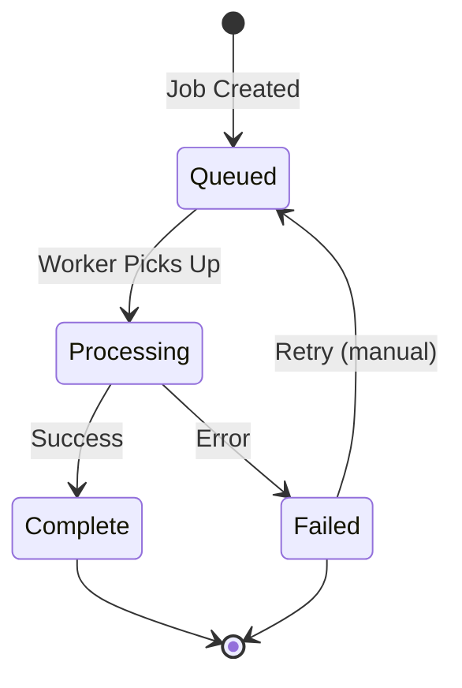

Genie Helper offers 4 core media processing operations powered by the BullMQ media worker. All operations run server-side using ImageMagick (images) and FFmpeg (video/audio).

## Available Operations

<CardGroup cols={2}>
  <Card title="Watermark" icon="stamp">
    Apply your logo/signature to images and videos (ImageMagick + FFmpeg overlay)
  </Card>
  
  <Card title="Teaser Creation" icon="film">
    Auto-generate 15-30s preview clips from full videos
  </Card>
  
  <Card title="Compression" icon="file-zipper">
    Reduce file size without visible quality loss (web delivery optimization)
  </Card>
  
  <Card title="Crop & Resize" icon="crop">
    Adjust aspect ratios for platform-specific requirements (1:1, 9:16, 16:9)
  </Card>
</CardGroup>

---

## Watermarking Content

<Tip>
  **Watermarks are unlimited on all plans** — even the free Starter tier. Use them liberally to protect your content.
</Tip>

### How Watermarking Works

- **Images:** ImageMagick composite overlay (PNG with alpha transparency)
- **Videos:** FFmpeg `-filter_complex overlay` (renders watermark into every frame)
- **Position:** Bottom-right corner by default (configurable in future updates)
- **Opacity:** 70% by default (semi-transparent)

### Applying a Watermark

<Steps>
  <Step title="Navigate to Media Library">
    Go to `/app/media` to see your scraped content grid.
  </Step>

  <Step title="Hover Over Media Item">
    Hover over any image or video thumbnail. You'll see a 4-button action strip appear at the bottom:

    - **Crop** (blue)
    - **Compress** (violet)
    - **Watermark** (green)
    - **Download** (gray)
  </Step>

  <Step title="Click Watermark Button">
    Click the **Watermark** button (stamp icon). This triggers:

    1. A `media_jobs` record is created:
       ```json
       {
         "operation": "apply_watermark",
         "status": "queued",
         "params": {
           "media_id": "abc-123",
           "position": "bottom-right",
           "opacity": 0.7
         }
       }
       ```
    2. Job is enqueued to BullMQ `media-jobs` queue
    3. `media-worker` picks it up and processes it using ImageMagick or FFmpeg
  </Step>

  <Step title="Monitor Progress">
    A toast notification appears: **"Watermark queued"**

    Watch the job status in the **Active Jobs** panel (bottom of Media Library page):

    - **Queued** (gray) → **Processing** (spinning blue) → **Complete** (green)

    Processing time:
    - **Images:** ~100ms (near-instant)
    - **Videos:** ~30s for a 2-minute 1080p clip (depends on length and resolution)
  </Step>

  <Step title="Download Watermarked File">
    Once status shows **Complete**:

    1. Hover over the same media item
    2. Click the **Download** button (bottom-right in the action strip)
    3. Browser downloads the watermarked version

    **Note:** The original file remains untouched. The watermarked version is stored as a separate file reference in Directus.
  </Step>
</Steps>

### Watermark Configuration

Currently, watermark settings are server-side defaults. To customize:

1. Go to `/admin` (Directus admin panel)
2. Navigate to **Settings** → **Project Settings** → **Files**
3. Upload your watermark logo (PNG with transparency recommended)
4. Update `server/utils/mediaWorker/watermark.js` with your logo path and preferences

<Note>
  **Roadmap:** UI-based watermark editor (drag position, adjust opacity, upload custom logos) is planned for Phase 10.
</Note>

---

## Creating Video Teasers

Teasers are 15-30 second clips extracted from full-length videos — perfect for platform previews, social media promo, or free content samples.

### Teaser Generation Rules

- **Input:** Any video in your `scraped_media` collection
- **Output:** 15-30s MP4 (H.264 + AAC), max 1280x720 resolution
- **Logic:**
  - Videos < 30s → entire video is the teaser (no cutting)
  - Videos 30s–2min → first 30s
  - Videos > 2min → middle 30s (to avoid intros/outros)

### Creating a Teaser

<Steps>
  <Step title="Open Media Library">
    Navigate to `/app/media`.
  </Step>

  <Step title="Filter to Videos">
    Click the **Video** filter at the top to show only video content.
  </Step>

  <Step title="Select a Video">
    Hover over a video thumbnail and click the **Crop** button (this will be renamed to "Teaser" in a future update).

    Alternatively, use the AI chat widget:
    ```
    Create a 30-second teaser from my latest OnlyFans video
    ```

    Genie will:
    1. Find the most recent video
    2. Queue a `create_teaser` job
    3. Return the job ID
  </Step>

  <Step title="Wait for Processing">
    Teaser creation takes ~30s per video (FFmpeg render time).

    Monitor in the **Active Jobs** panel:
    - Job type: `create_teaser`
    - Status: **Processing** (with progress bar if available)
  </Step>

  <Step title="Download Teaser">
    Once complete:

    1. The teaser is saved as a new `scraped_media` record with `media_type: 'teaser'`
    2. Appears in your Media Library with a **Teaser** badge
    3. Hover and click **Download** to save locally
  </Step>
</Steps>

### Teaser Limits by Plan

| Plan | Teaser Clips per Month |
|------|------------------------|
| Starter | 0 (blocked — video ops require Creator tier) |
| Creator | 10 |
| Pro | 50 |
| Studio | Unlimited |

<Warning>
  **Starter plan blocks all video operations** to prevent CSAM risk and bandwidth abuse. Upgrade to Creator ($49/mo) to unlock teasers.
</Warning>

---

## Compressing Media

Compression reduces file size for faster uploads and platform delivery without visible quality loss.

### Compression Settings

- **Images:** JPEG quality 85, progressive encoding (via ImageMagick)
- **Videos:** H.264 CRF 23, AAC 128kbps audio (via FFmpeg)
- **Target:** 30-50% size reduction while maintaining visual fidelity

### Compressing Files

<Steps>
  <Step title="Select Media Item">
    In `/app/media`, hover over an image or video.
  </Step>

  <Step title="Click Compress Button">
    Click the **Compress** button (file-zipper icon, violet highlight on hover).
  </Step>

  <Step title="Monitor Job">
    Check the **Active Jobs** panel:
    - Operation: `compress`
    - Progress: displays percentage (if available)
    - ETA: ~5-10s for images, ~20-40s for videos
  </Step>

  <Step title="Download Compressed Version">
    Once complete, click **Download** to save the compressed file.

    **Size comparison:**
    - Original: 12.4 MB
    - Compressed: 5.8 MB (53% reduction)
  </Step>
</Steps>

<Tip>
  **Batch compression coming soon:** Select multiple items and compress all at once (roadmap Phase 10).
</Tip>

---

## Cropping & Resizing

Adjust aspect ratios to match platform requirements (Instagram 1:1, TikTok 9:16, YouTube 16:9, etc.).

### Supported Aspect Ratios

- **1:1** (Square) — Instagram feed, profile pics
- **4:5** (Portrait) — Instagram feed
- **9:16** (Vertical) — TikTok, Instagram Stories, Reels
- **16:9** (Landscape) — YouTube, Twitter, Reddit

### Cropping a File

<Steps>
  <Step title="Open Media Library">
    Go to `/app/media`.
  </Step>

  <Step title="Click Crop Button">
    Hover over a media item and click the **Crop** button (blue highlight).
  </Step>

  <Step title="Select Aspect Ratio">
    A modal opens with preset ratios:

    - 1:1 Square
    - 4:5 Portrait
    - 9:16 Vertical
    - 16:9 Landscape
    - Custom (enter width × height)

    Click your preferred ratio.
  </Step>

  <Step title="Adjust Crop Area (Optional)">
    A preview shows the crop boundaries. Drag to reposition.

    Click **Apply Crop**.
  </Step>

  <Step title="Download Cropped File">
    The cropped version is saved and available for download.
  </Step>
</Steps>

<Note>
  **Current limitation:** Crop modal UI is not yet implemented. The crop button queues a job with default center-crop. UI editor is planned for Phase 10.
</Note>

---

## Batch Processing

Process multiple files at once to save time.

### Batch Watermark Example

<Steps>
  <Step title="Select Multiple Items">
    In `/app/media`, hold **Shift** and click multiple thumbnails to select them (checkbox appears in top-left of each).
  </Step>

  <Step title="Click Batch Actions">
    A floating action bar appears at the bottom with:

    - **Watermark All** (green)
    - **Compress All** (violet)
    - **Download All** (gray zip icon)
  </Step>

  <Step title="Click 'Watermark All'">
    This creates one `media_jobs` record per selected item, all with `operation: 'apply_watermark'`.

    All jobs are enqueued to BullMQ in parallel.
  </Step>

  <Step title="Monitor Job Queue">
    The **Active Jobs** panel shows all queued jobs. BullMQ processes them concurrently (up to 5 at a time by default).

    Total time: ~5-10 minutes for 100 images, ~30-60 minutes for 50 videos.
  </Step>
</Steps>

<Warning>
  **Batch actions are not yet implemented in the UI.** You can manually queue jobs via the AI chat widget:

  ```
  Watermark all images in my OnlyFans media library
  ```

  Genie will use the `media-process` Action flow to queue them.
</Warning>

---

## Job Status Tracking

All media operations create `media_jobs` records in Directus. You can monitor them in:

### Dashboard Job Panel

At the bottom of `/app/media`, you'll see:

- **Active Jobs:** Currently processing
- **Queued Jobs:** Waiting in BullMQ
- **Recent Jobs:** Last 10 completed (with success/failure status)

### Directus Admin Panel

1. Go to `/admin`
2. Navigate to **Content** → **Media Jobs**
3. View all jobs with:
   - Operation type
   - Status (queued, processing, complete, failed)
   - Error messages (if failed)
   - Job parameters (JSON)

### Job Lifecycle



---

## Error Handling

<AccordionGroup>
  <Accordion title="Job stuck in 'processing' for 10+ minutes">
    **Cause:** Worker crashed or Stagehand browser session hung.

    **Fix:**
    1. Go to `/admin` → **Media Jobs**
    2. Find the stuck job and note the ID
    3. SSH into your server: `pm2 restart media-worker`
    4. Manually re-queue the job via the dashboard or AI chat
  </Accordion>

  <Accordion title="Watermark job failed: 'Logo file not found'">
    **Cause:** Watermark logo path is incorrect in `server/utils/mediaWorker/watermark.js`.

    **Fix:**
    1. Upload a watermark logo to Directus Files
    2. Update `WATERMARK_PATH` in `watermark.js`
    3. Restart the media worker: `pm2 restart media-worker`
  </Accordion>

  <Accordion title="Video teaser failed: 'FFmpeg error'">
    **Cause:** Source video is corrupted or in an unsupported format.

    **Fix:**
    1. Download the original video
    2. Re-encode it with FFmpeg: `ffmpeg -i input.mp4 -c:v libx264 -c:a aac output.mp4`
    3. Re-upload to Genie Helper
    4. Retry teaser creation
  </Accordion>
</AccordionGroup>

---

## Next Steps

<CardGroup cols={2}>
  <Card title="Schedule Posts" icon="calendar-check" href="/guides/scheduling-posts">
    Queue processed media for automated publishing
  </Card>
  
  <Card title="AI Captions" icon="sparkles" href="/api/captions">
    Generate captions for your watermarked content
  </Card>
  
  <Card title="Plan Limits" icon="gauge" href="/guides/pricing-tiers">
    Check your remaining watermark/teaser quota
  </Card>
</CardGroup>