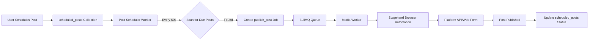

Genie Helper's post scheduler automatically publishes queued content to your connected platforms. It runs every 60 seconds, checking for posts scheduled to go live.

## How the Scheduler Works

### Architecture



### Worker Responsibilities

- **Polling:** Checks `scheduled_posts` collection every 60 seconds
- **Due Detection:** Finds posts where `scheduled_time <= NOW()` and `status = 'queued'`
- **Job Creation:** Creates `media_jobs` with `operation: 'publish_post'`
- **Platform Dispatch:** Uses Stagehand to automate platform-specific posting workflows
- **Status Updates:** Marks posts as `published` or `failed` after completion

---

## Scheduling Your First Post

<Steps>
  <Step title="Prepare Your Content">
    Before scheduling, make sure you have:

    - **Media file:** Image, video, or audio uploaded to `/app/media`
    - **Caption:** Written text (or generate with AI — see [AI Captions guide](/guides/ai-captions))
    - **Platform connection:** At least one platform connected in `/app/platforms`
  </Step>

  <Step title="Open the Scheduling Interface">
    **Option 1:** Via Media Library
    1. Go to `/app/media`
    2. Click on a media item to open the detail view
    3. Click **Schedule Post** button

    **Option 2:** Via AI Chat Widget
    1. Click the chat icon (bottom-right)
    2. Type:
       ```
       Schedule my latest OnlyFans photo for tomorrow at 6 PM with caption "New content dropping 🔥"
       ```
    3. Genie will create the scheduled post for you

    **Option 3:** Direct API (for developers)
    ```bash
    curl -X POST https://geniehelper.com/api/directus/items/scheduled_posts \
      -H "Authorization: Bearer YOUR_TOKEN" \
      -H "Content-Type: application/json" \
      -d '{
        "platform": "onlyfans",
        "media_id": "abc-123-media-uuid",
        "caption": "New content 🔥",
        "scheduled_time": "2026-03-10T18:00:00Z",
        "status": "queued"
      }'
    ```
  </Step>

  <Step title="Fill Out Post Details">
    In the scheduling modal, enter:

    **Platform:** Select target platform (OnlyFans, Fansly, Instagram, etc.)

    **Media:** Select one or more files from your library

    **Caption:** Enter your post text (max 5000 characters)

    **Scheduled Time:** Pick date and time (uses your browser's timezone, converted to UTC on save)

    **Tags (optional):** Add platform-specific hashtags or tags

    **Price (optional):** For paid content platforms (OnlyFans PPV, Fansly tiers, etc.)
  </Step>

  <Step title="Click 'Schedule Post'">
    The system:

    1. Creates a `scheduled_posts` record:
       ```json
       {
         "id": "post-uuid-123",
         "platform": "onlyfans",
         "media_id": "media-abc-456",
         "caption": "New content 🔥",
         "scheduled_time": "2026-03-10T18:00:00.000Z",
         "status": "queued",
         "creator_profile_id": "profile-xyz-789"
       }
       ```
    2. Redirects you to `/app/calendar` (or shows success toast)
  </Step>

  <Step title="Verify in Calendar View">
    Go to `/app/calendar` to see all scheduled posts in a calendar grid.

    **Post card displays:**
    - Thumbnail of media
    - Platform badge (color-coded)
    - Scheduled time
    - Caption preview (first 100 chars)
    - Status badge (Queued / Publishing / Published / Failed)
  </Step>
</Steps>

---

## Queue Management

### Viewing Your Queue

All scheduled posts are visible in:

1. **Calendar View** (`/app/calendar`) — visual timeline
2. **Dashboard Stats** — "Scheduled" count in the stat card
3. **Directus Admin** (`/admin` → `scheduled_posts` collection)

### Editing a Scheduled Post

<Steps>
  <Step title="Find the Post">
    In `/app/calendar`, locate the post card.
  </Step>

  <Step title="Click 'Edit'">
    Click the **gear icon** in the top-right of the post card.
  </Step>

  <Step title="Update Fields">
    Modify:
    - Caption
    - Scheduled time
    - Media attachments
    - Tags/hashtags

    You **cannot** change the platform after creation (delete and recreate instead).
  </Step>

  <Step title="Save Changes">
    Click **Update Post**. Changes are saved immediately.

    If the post was already picked up by the scheduler (status = `publishing`), edits won't apply.
  </Step>
</Steps>

### Canceling a Scheduled Post

<Steps>
  <Step title="Open Post Card">
    In `/app/calendar`, find the post.
  </Step>

  <Step title="Click 'Cancel'">
    Click the **X icon** or **Cancel** button.
  </Step>

  <Step title="Confirm Deletion">
    A confirmation modal appears: "Cancel this scheduled post? This cannot be undone."

    Click **Confirm**.
  </Step>

  <Step title="Post Removed">
    The `scheduled_posts` record is:
    - Marked as `status: 'cancelled'` (not deleted)
    - Hidden from the calendar view
    - Skipped by the scheduler worker
  </Step>
</Steps>

---

## Platform-Specific Publishing

Each platform has unique posting requirements. Genie uses Stagehand browser automation to handle them.

### OnlyFans

**Supported:**
- Image posts (single or gallery)
- Video posts (up to 5GB)
- Caption text (max 5000 chars)
- Price (free or PPV)
- Post visibility (all subscribers / VIP only)

**Flow:**
1. Stagehand logs in (using cookies or credentials)
2. Navigates to **Post** page
3. Uploads media via file input
4. Fills caption textarea
5. Sets price dropdown (if PPV)
6. Clicks **Publish**
7. Waits for success confirmation

**Estimated time:** 30-60 seconds per post

### Fansly

**Supported:**
- Image/video posts
- Captions (max 3000 chars)
- Tier restrictions (All / Tier 1 / Tier 2 / Tier 3)
- Scheduled posts (via Fansly's native scheduler)

**Flow:** Similar to OnlyFans, but uses Fansly's tier dropdown.

### Instagram

**Supported:**
- Feed posts (1:1 or 4:5 aspect ratio)
- Reels (9:16 vertical video)
- Captions (max 2200 chars)
- Hashtags (up to 30)

**Limitations:**
- **No direct API** — uses Stagehand to automate the web uploader
- **May trigger bot detection** — use sparingly
- **Alt text not supported** (yet)

**Flow:**
1. Navigate to instagram.com
2. Click **+ Create**
3. Upload media
4. Add caption and hashtags
5. Click **Share**

### TikTok

**Supported:**
- Video posts (9:16, 15s–10min)
- Captions (max 150 chars)
- Hashtags

**Limitations:**
- **No automation support yet** — requires manual upload
- Stagehand integration planned for Phase 10

### X (Twitter)

**Supported:**
- Text posts (max 280 chars, or 25,000 for X Premium)
- Image posts (up to 4 images)
- Video posts (max 2:20 for free, 60 min for Premium)

**Flow:**
1. Navigate to x.com
2. Click **Post** button
3. Fill text box
4. Upload media
5. Click **Post**

---

## Queue Size Limits

The number of posts you can have **queued** at once depends on your plan:

| Plan | Max Queued Posts |
|------|------------------|
| Starter | 3 |
| Creator | Unlimited |
| Pro | Unlimited |
| Studio | Unlimited |

<Warning>
  **Starter users:** You can only have 3 posts in the queue at a time. Once a post publishes, you can schedule another. This is designed to encourage upgrading to Creator ($49/mo).
</Warning>

---

## Monitoring Published Posts

### Real-Time Status Updates

When the scheduler picks up a post:

1. **Status changes to `publishing`** (blue "Processing" badge)
2. **Job created in `media_jobs`** with `operation: 'publish_post'`
3. **Stagehand browser session starts**
4. **Platform login + upload + submit**
5. **Status updates to `published`** (green "Published" badge) or `failed` (red "Failed" badge)

### Success Confirmation

On success, the `scheduled_posts` record stores:

```json
{
  "status": "published",
  "published_at": "2026-03-10T18:01:23.000Z",
  "platform_post_url": "https://onlyfans.com/123456789/post-abc",
  "platform_post_id": "123456789"
}
```

You can click the **View on Platform** button in the calendar to open the live post.

### Failure Handling

If publishing fails:

1. Status changes to `failed`
2. Error message stored in `error_message` field
3. Post card shows **Retry** button
4. Click **Retry** to re-queue the post

Common errors:
- "Login failed: Invalid cookies" → Recapture cookies via [HITL guide](/guides/hitl-sessions)
- "Media upload failed: File too large" → Compress the file first
- "Platform error: Duplicate content detected" → Platform rejected the post (edit and retry)

---

## Advanced: Bulk Scheduling

Schedule multiple posts at once using the AI chat widget.

### Example: Schedule a Week of Content

```
Schedule these 7 OnlyFans posts:
- Monday 6 PM: "Gym selfie 💪" (media ID: abc-123)
- Tuesday 6 PM: "New lingerie set 😘" (media ID: def-456)
- Wednesday 6 PM: "Behind the scenes 🎬" (media ID: ghi-789)
- Thursday 6 PM: "Throwback Thursday 🔥" (media ID: jkl-012)
- Friday 6 PM: "Friday vibes 🥂" (media ID: mno-345)
- Saturday 6 PM: "Weekend plans? 😏" (media ID: pqr-678)
- Sunday 6 PM: "Self-care Sunday 🛁" (media ID: stu-901)
```

Genie will:
1. Parse the list
2. Create 7 `scheduled_posts` records
3. Calculate UTC timestamps for each "6 PM" in your timezone
4. Return a summary with post IDs

---

## Troubleshooting

<AccordionGroup>
  <Accordion title="Post stuck in 'publishing' for 10+ minutes">
    **Cause:** Stagehand browser session hung or worker crashed.

    **Fix:**
    1. SSH to server: `pm2 logs media-worker`
    2. Look for errors mentioning the job ID
    3. Restart worker: `pm2 restart media-worker`
    4. Go to `/app/calendar` and click **Retry** on the post
  </Accordion>

  <Accordion title="Post published but status still shows 'queued'">
    **Cause:** Worker failed to update Directus after publishing.

    **Fix:**
    1. Check `media_jobs` in `/admin` for the job's actual status
    2. Manually update `scheduled_posts` record: set `status: 'published'`
    3. Report the bug to support
  </Accordion>

  <Accordion title="Post failed: 'Platform login required'">
    **Cause:** Cookies expired or credentials invalid.

    **Fix:**
    1. Go to `/app/platforms`
    2. Check platform connection status
    3. If red "Error" badge, recapture cookies via the browser extension ([HITL guide](/guides/hitl-sessions))
    4. Retry the post
  </Accordion>

  <Accordion title="Can't schedule more posts (queue full)">
    **Cause:** You've hit your plan's queue limit (3 for Starter, unlimited for paid plans).

    **Fix:**
    1. Wait for existing posts to publish (they auto-remove from queue)
    2. Or cancel some queued posts to free up slots
    3. Or upgrade to Creator tier for unlimited queue
  </Accordion>
</AccordionGroup>

---

## Next Steps

<CardGroup cols={2}>
  <Card title="AI Captions" icon="sparkles" href="/api/captions">
    Generate engaging captions for scheduled posts
  </Card>
  
  <Card title="Media Workflows" icon="wand-magic-sparkles" href="/guides/media-workflows">
    Watermark and compress before scheduling
  </Card>
  
  <Card title="HITL Sessions" icon="hand" href="/guides/hitl-sessions">
    Keep platform cookies fresh for reliable publishing
  </Card>
</CardGroup>